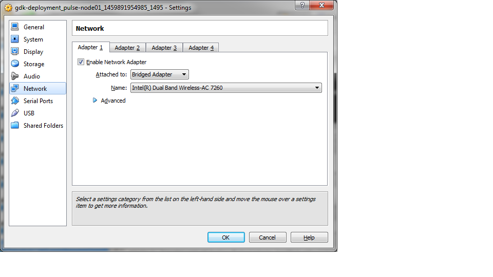
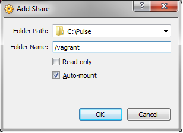

GDK Setup
==========

This guide is about setting up the GDK laptop and deploying a Pulse instance to a VM on the laptop. The deployment process uses Vagrant files and Ansible playbooks in the **ansible-symphony-ist** repository. This document should be used in conjunction with the :doc:`pulse_deployment` guide in the **ansible-symphony-ist** documentation.

Requirements
-------------

The hardware and software requirements for the GDK are:

- Laptop with Windows 7 or higher
- ZIP file of **ansible-symphony-ist** repository on a flash drive

.. note:: For security, you will need to update some vars that are encrypted in the vault files as we use these internally and do not want to give them out. The following credentials are located in the ``/group_vars/all/vault`` file and should be updated:

  - vault_pulse_password
  - vault_mysql_root_password

  Additionally, the following vars are needed only for legacy installs and should be blank out:

  - vault_pulse_serial
  - vault_pulse_password_hash

  To update the ``vault`` file, navigate to the directory the ``vault`` file is located and run 
  ::

      ansible-vault edit vault

  You will be prompted for a password. Use the password in the ``vault.passwd`` file. For more information on updating vault files see http://docs.ansible.com/ansible/playbooks_vault.html .

  Be sure to document the updated passwords.

GDK Laptop Setup
-----------------

Most GDK laptops to set up will come out of the box. You may need to set up the user account and complete the initial OS configurations required to run the laptop. Be sure to install all Windows updates as part of this process.

.. note:: Be sure to document the username and password.

Oracle VM VirtualBox
^^^^^^^^^^^^^^^^^^^^^
After the OS has been configured and updated, the  next steps for setting up the GDK laptop are to install the required software for Pulse installation and setup. Oracle VM VirtualBox is the first software to install. You can download the installer at https://www.virtualbox.org/wiki/Downloads . Once the download is complete, run the installer and complete the installation.

Vagrant
^^^^^^^^
After installing VirtualBox, you will need to install Vagrant to create the Pulse VM. You can download the installer at https://www.vagrantup.com/downloads.html . Once the download is complete, run the installer and complete the installation. After installation, open the *Command Prompt* and run the following command to confirm vagrant is running correctly:

::

    > vagrant -v
    Vagrant 1.8.1

Notepad++
^^^^^^^^^^
To make things easier, you should install Notepad++ for editing Vagrant and Ansible playbook files. You can download the installer for Notepad++ at https://notepad-plus-plus.org/download/v6.9.1.html . Once the downlaod is complete, run the installer and complete the installation.

ansible-symphony-ist
^^^^^^^^^^^^^^^^^^^^^
After installing all the required software, create a new directory ``C:\Pulse``. Then copy the **ansible-symphony-ist** ZIP file contained on the flash drive to the ``C:\Pulse`` directory and extract all files in the ZIP file to this directory. You are now ready to set up and deploy the Pulse VM.

Pulse VM Deployment Setup
--------------------------

To create the Pulse VM, using the *Command Prompt* navigate to ``C:\Pulse``. The Ansible playbooks from the **ansible-symphony-ist** that were extracted in the previous section should be located here. The first step to prepare the Pulse VM deployment is to update the ``vagrant_hosts`` file. Update the ``vagrant_hosts`` file to:

::

    127.0.0.1        localhost
    192.168.33.101   pulse-node01                pnode01  ubuntu

.. note:: We are using the IP range 192.168.33.101 to 192.168.33.200 for these VM's. You may use any IP in this range.

You are now ready to start the Pulse VM. To start it, make sure you are in the ``C:\Pulse`` directory, then run the following command:

::

    > vagrant up pulse-node01

.. note:: You may see an error logged by Vagrant during the VM creation process regarding a missing file ``id_rsa.pub``. You can ignore this as it will have no effect what we are doing. If you wish to avoid this error, you can comment out the following line in the ``Vagrantfile`` with a pound (#) sign:

  # config.vm.provision :shell, inline: "cat /vagrant/id_rsa.pub >> /home/vagrant/.ssh/authorized_keys"

We are using Vagrant only for the ease of creating the VM initially. Once the Pulse VM is successfully up and running, open the Oracle VM VirtualBox application. You should see the Pulse VM in the machine list in the left hand column. It should have a status of *Running*. Once this is confirmed, return to the *Command Prompt* and shut down the Pulse VM with the following command:

::

    > vagrant halt pulse-node01

You are now ready to configure the Pulse VM.

Pulse VM Configuration
-----------------------

Now that we have a working Pulse VM in VirtualBox, the next phase of the setup is to configure the VM for Pulse installation. To begin, open the Oracle VM VirtualBox application and find the newly created VM in the machine list in the left column. You first need to reconfigure the network adapters. To do this, select the Pulse VM and click the **Settings** button. The ``Settings`` modal window should appear. Select **Network** in the left column. Update Adapter 1 to *Bridged Adapter* as shown below.

Click the **OK** button to save your changes. Next click the **Start** button. After the VM has booted, you will need to sign in to the box. You can use the **vagrant** user for this initial sign in.

.. note:: The default password for the **vagrant** user is vagrant.

Base Packages
^^^^^^^^^^^^^^
The Pulse VM will need some base packages installed, including Ansible, before we can run the Pulse installation playbooks. To do this, run the following commands:

::

    $ sudo apt-get update
    $ sudo apt-get install -y software-properties-common
    $ sudo apt-add-repository ppa:ansible/ansible
    $ sudo apt-get update
    $ sudo apt-get install -y vim
    $ sudo apt-get install -y ansible
    $ sudo apt-get update

Confirm that the Ansible version installed is 2+ with the following command:

::

    $ ansible --version

OpenSSH Update
^^^^^^^^^^^^^^^
For the Ansible playbooks to run correctly, OpenSSH_6.9+ must be installed. To check your current version, run the following command:

::

    $ ssh -V

If you need to update OpenSSH, you will need to download the OpenSSH source, build it, and then install it. To do this, run the following commands:

::

    $ cd /home/vagrant/
    $ sudo apt-get install -y zlib1g-dev (required to build new openSSH)
    $ sudo apt-get install -y libssl-dev
    $ sudo apt-get update
    $ wget https://launchpad.net/ubuntu/+archive/primary/+files/openssh_7.2p2.orig.tar.gz
    $ tar -xvf openssh_7.2p2.orig.tar.gz
    $ cd openssh-7.2p2/
    $ ./configure --sysconfdir=/etc/ssh --with-md5-passwords --with-privsep-path=/var/lib/sshd
    $ sudo make
    $ sudo service ssh stop
    $ sudo make install
    $ ssh -V
    OpenSSH_7.2p2, OpenSSL 1.0.1f 6 Jan 2014
    $ sudo service ssh start
    $ sudo apt-get update

.. note:: If the OpenSSH version does not seem to update to 7.2, shut down and reboot the machine. Upon logging in, confirm that OpenSSH has been updated.

Pulse Deployment
^^^^^^^^^^^^^^^^^
Before you can run the playbooks, you will have to mount the ``/vagrant`` directory to the VM. First, ensure the ``C:\Pulse`` directory is properly set up as a Shared Folder in Oracle VM VirtualBox. To do this, select the Pulse VM and click the **Settings** button. The ``Settings`` modal window should appear. Select **Shared Folders** in the left column. The ``C:\Pulse`` directory should be listed under *Machine Folders* in the Folders List. Click the **Edit** icon and confirm the settings as shown below.

To mount the directory on the VM, start the VM and after logging in, run the following command:

::

    $ sudo mount -t vboxsf vagrant /vagrant

.. note:: You cannot run the mount command if you are in the ``/vagrant`` directory. It will cause the mount to fail.

After you run this command, navigate to the ``/vagrant`` directory and run the ``ls`` command. You should see all the repository files listed.

Due to file premissions, you will not be able to access the ``/vagrant/vault.passwd`` file during playbook execution because it is an executable. This is a Windows issue. To get around this, you have to copy the file to different directory and remove the executable permission. To do this, run the following commands:

::

    $ sudo cp /vagrant/vault.passwd /home/vagrant/vault.passwd
    $ sudo chmod -x /home/vagrant/vault.passwd

You can now run the Pulse playbooks with the following commands:

::

    $ ansible-playbook -i gdk.inventory --tags deps-pulse --vault-password-file /home/vagrant/vault.passwd -c local site-infrastructure.yml
    $ ansible-playbook -i gdk.inventory --tags site-pulse-app --vault-password-file /home/vagrant/vault.passwd -c local site-applications.yml

For further details about running the playbooks, see the :doc:`pulse_deployment` guide.

Supervisord Update
^^^^^^^^^^^^^^^^^^^
Supervisord has known issues with Ubuntu with regards to not starting on boot. To correct this, you must create a start script and add it to cron. To create the script first open vim via the ``sudo vim`` command. Insert the following code into the new file:

::
    
    #!/bin/bash
    sudo service supervisord restart

When you are done, save the file as ``/usr/local/bin/supervisord_boot.sh``. Close the file.

Next, you need to create a cron job to run the script on boot. To do this, open the crontab editor with the following command:

::

    sudo crontab -e

Insert the following code into the editor on a new line:

::
  
    #Supervisord: Start on boot
    @reboot /usr/local/bin/supervisord_onboot.sh

Save the new cron job and close the crontab editor.

Apache Update
^^^^^^^^^^^^^^
In order to be able to browse the Pulse site by the IP address, you need to remove the default config file from Apache. To o this, run the following code:

::

    $ cd /etc/apache2/sites-enabled/
    $ sudo rm 000-default.conf
    $ sudo service apache2 restart

.. note:: You are only removing the symlink in the ``/sites-enabled`` directory and not the actual file in the ``/sites-available`` directory. If you need to restore this functionality, just re-create the symlink in ``/sites-enabled``.

gdk-admin User
^^^^^^^^^^^^^^^
The last thing to do for the Pulse VM configuration is to create the **gdk-admin** user. The **gdk-admin** user will be the primary user on the machine for our client. To create the user, run the following command:

::

    $ sudo adduser gdk-admin

You will be asked to assign and confirm a password for the new user. No additional details for the user need to be added. 

To add the new user **gdk-admin** to the sudo group, run the following command to open the sudo configurtion file:

::

    $ sudo visudo

To this file, find the line ``root     ALL=(ALL:ALL) ALL`` and add the **gdk-admin** line directly below it so it reads:

::

    root      ALL=(ALL:ALL) ALL
    gdk-admin ALL=(ALL:ALL) ALL 

To save your changes, type **Left-CTRL-X**, followed by **Y**, and then **Enter** to confirm and close. After this, you will need to log out as **vagrant** and then log back in as **gdk-admin**.

After you have successfully tested login and sudo privileges, delete the **vagrant** user.

Router Setup
-------------
Need to get a router and walk through.

Gateway Device(s)
------------------

Testing
--------
The first thing to test is that you can browse the Pulse instance you have installed on the Pulse VM. Open a browser on the GDK laptop and point it to http://192.168.33.101/pulse .

.. note:: If you used a different IP address, use that IP address to browse Pulse.

If the Pulse website comes in, log in with the ``pulse-admin`` username and ``vault_pulse_password`` you created. 

If you can succesffuly login, navigate to the ``Analysis`` tab and ensure Kibana is running.

Clean Up
---------
After successful installation and configuration of the GDK, all repository files should be deleted from the laptop. Additionally, you should confirm that the **vagrant** user has been removed from the Pulse VM and the ``/home/vagrant`` directory has been deleted.
