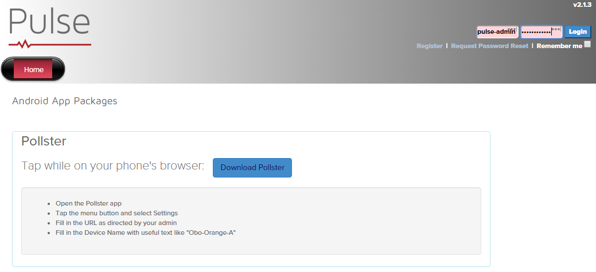
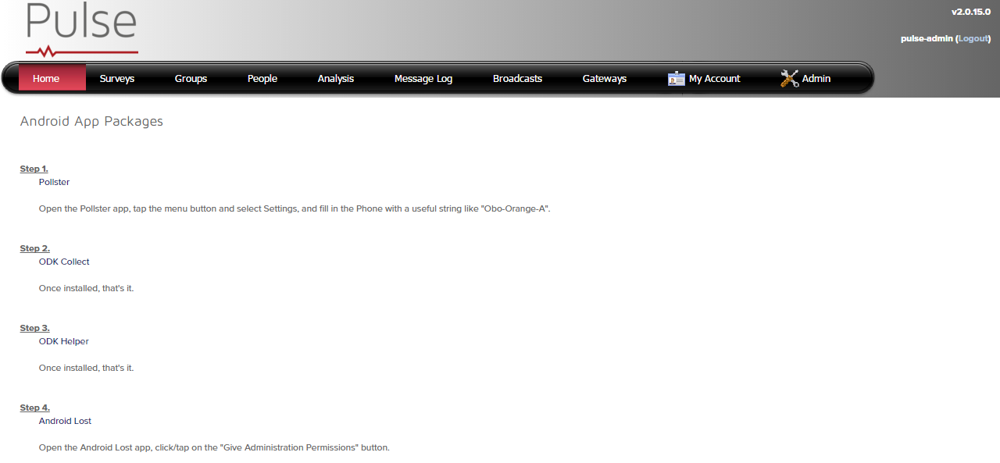

Pulse UI DB App
===============

Configures the Pulse DB for the Pulse UI App.

Ansible Keys
------------

* **[pulse-ui-node]** - The machine the Pulse instance is deloyed to.

UI Ports
--------

* **<pulse-ui-node>:80** - The non-secure Pulse UI.
* **<pulse-ui-node>:443** - The SSL-protected Pulse UI.

Verify Your Installation
------------------------

In a browser, navigate the Pulse UI website at **<pulse-ui-node>/pulse**. You should see:

Enter the titan user credentials and click **Login**.

Verify the login was successful. You should see:

