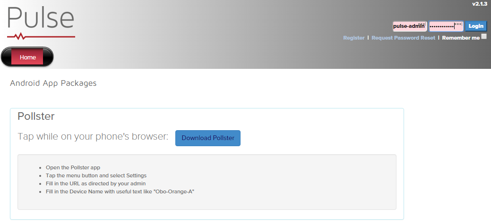

Pulse Deployment
===================

This guide is about deploying Pulse to development and GDK environments. The deployment process uses Ansible playbooks in the **ansible-symphony-ist** repository. To better understand how software deployments using the playbooks in this repository work, please look at the :doc:`ist_quickstart` guide in the **ansible-symphony-ist** documentation.

The Ansible playbooks will be run from a server or computer which we call the **Deployment Machine**. The Pulse platform is installed and configured on a server or computer which we call the **Pulse Host**. 

Requirements
--------------

For the deployment to work correctly, a passwordless SSH connection between the Deployment Machine and the Pulse Host must exist. Additionally, if you choose to run the playbooks with a user other than the *vagrant* user, that user must be part of the sudo group.

Both virtual machines created by the *Vagrantfile* install the necessary Ubuntu 14.04.3 OS by default.

Deployment Machine
^^^^^^^^^^^^^^^^^^^

Please see the requirements for the Deployment Machine in the :doc:`../topics/quickstart` guide.

Pulse Host
^^^^^^^^^^^
The OS for the Pulse Host must be Ubuntu 14.04.3 LTS (GNU/Linux 3.13.0-63-generic x86_64).

Configuration
--------------

You will need to update your machine's *hosts* file with the correct IP addresses and machine names to match the below values. You can also see this information in the *vagrant_hosts* file in the **ansible-symphony-ist** repository.

::

    192.168.33.111     vagrant-ist-01
    192.168.33.112     vagrant-ist-02

You will have to copy your **id_rsa.pub** file to the base directory of the checked out **ansible-symphony-ist** repo on your computer.

Lastly, before running anything you will need to download the "Ansible vault" password from Last Pass and set up the **vault.passwd** file inside your Ansible repo. You an read more about this in the :doc:`ist_quickstart` guide.

VM Creation
------------

The Vagrantfile and playbooks have been configured for immediate deployment. There are four different deployment configurations you may use. 

::

    Deployment Machine      Pulse Host         ES Client Node      Inventory 
    -------------------     --------------     ---------------     ----------
    Your computer           vagrant-ist-01     vagrant-ist-02      staging
    Your computer           vagrant-ist-01     None                gdk
    vagrant-ist-01          vagrant-ist-01     vagrant-ist-02      staging
    vagrant-ist-01          vagrant-ist-01     None                gdk

Depending on which configuration you will be deploying with, you will need to start one or two virtual machines. To start a virtual machine, first navigate to the main directory of the checked out **ansible-symphony-ist** repo on your computer. From this directory, you can start the ``vagrant-ist-01`` vm with the following command: ::

    $ vagrant up vagrant-ist-01

If you want to start both vm's, run the following command: ::

    $ vagrant up

Setting Up the Deployment Machine
----------------------------------

If your Deployment Machine does not meet the base requirements, or you will be using ``vagrant-ist-01`` as your Deployment Machine, you must set it up appropriately. First, ssh into the Deployment Machine in one of the following ways:

::

    $ vagrant ssh vagrant-ist-01

    OR

    $ ssh vagrant-ist-01

.. note:: When using ``vagrant ssh``, you will be connecting as the **vagrant** user. The **vagrant** user is part of the sudo group on the vm. When using just ``ssh``, you will be connecting as yourself. You may need to add yourself to the sudo group.

Once logged in and connected to the Deployment Machine, you must install Ansible. Run the following commands:

::

    $ sudo apt-get update
    $ sudo apt-get install -y software properties-common
    $ sudo apt-add-repository ppa:ansible/ansible
    $ sudo apt-get update
    $ sudo apt-get install -y ansible
    $ sudo apt-get update

.. note:: If you will be using the ``gdk`` inventory file for single machine deployment, you can skip this part as it does not require a ssh connection to itself.

Once Ansible is installed, you need to ensure the user you will use to run the playbooks can ssh into all required machines. To test this, run the following commands to ssh into the machines:

::

    $ ssh vagrant-ist-01
    $ ssh vagrant-ist-02

.. warning:: Windows users may experience issues attempting to ssh between vm's. If you are using the **staging** inventory and are unable to ssh into both ``vagrant-ist-01`` and ``vagrant-ist-02``, you may want to generate a new ssh key on the Deployment Machine and share it between vm's. To accomplish this, run the below commands on the Deployment Machine. If this scenario does not apply to you or you are not experiencing this issue, you can skip the below instructions and move on to the next section.

::

    $ ssh-keygen -t rsa -b 4096
    $ ssh-copy-id -i ~/.ssh/id_rsa.pub vagrant-ist-01
    $ ssh-copy-id -i ~/.ssh/id_rsa.pub vagrant-ist-02

Running the Playbooks
----------------------

Once the Deployment Machine is set up, you are ready to run the playbooks and install the Pulse platform into your desired environment. There are two plays you will need to run to accomplish this. ``site-infrastructure.yml`` is responsible for installing all required software needed for the Pulse platform. ``site-applications.yml`` installs the actual Pulse application, then configures all software and the application appropriately.

When using your machine as the Deployment Machine with the ``staging`` inventory to install the Pulse platform, run the following commands:

::

    $ cd /vagrant
    $ ansible-playbook -i staging --tags deps-pulse --vault-password-file vault.passwd site-infrastructure.yml
    $ ansible-playbook -i staging --tags site-pulse-app --vault-password-file vault.passwd site-applications.yml

When using your machine as the Deployment Machine with the ``gdk`` inventory to install the Pulse platform, run the following commands:

::

    $ cd /vagrant
    $ ansible-playbook -i gdk --tags deps-pulse --vault-password-file vault.passwd site-infrastructure.yml
    $ ansible-playbook -i gdk --tags site-pulse-app --vault-password-file vault.passwd site-applications.yml

.. note:: When using ``vagrant-ist-01`` as the Deployment Machine, you mush be logged in to the vm and all ansible commands are run on the vm.
    
When using ``vagrant-ist-01`` as the Deployment Machine with the ``staging`` inventory to install the Pulse platform, run the following commands:

::

    $ cd /vagrant
    $ ansible-playbook -i staging --tags deps-pulse --vault-password-file vault.passwd site-infrastructure.yml
    $ ansible-playbook -i staging --tags site-pulse-app --vault-password-file vault.passwd site-applications.yml
    
When using ``vagrant-ist-01`` as the Deployment Machine with the ``gdk`` inventory to install the Pulse platform, run the following commands:

::

    $ cd /vagrant
    $ ansible-playbook -i gdk --tags deps-pulse --vault-password-file vault.passwd -c local site-infrastructure.yml
    $ ansible-playbook -i gdk --tags site-pulse-app --vault-password-file vault.passwd -c local site-applications.yml

.. warning:: Windows users may experience permissions issues with the ``vault.passwd`` file. If when running the playbook Ansible throws an error regarding the ``vault.passwd`` being executable, the problem is likely due to Windows affecting the file permissions in the synced folder. The easiest way to reolve this is to copy the ``vault.passwd`` file to the ``/home/vagrant/`` directory, remove the executable bit from the copied file, and then re-run the playbook using that file as the ``--vault-password-file``. Below are the commands to follow.

::

    $ sudo cp /vagrant/vault.passwd /home/vagrant/vault.passwd
    $ sudo chmod -x /home/vagrant/vault.passwd
    $ ansible-playbook -i <inventory file> --tags <tag> --vault-password-file /home/vagrant/vault.passwd <playbook to run>

Verifying the Deployment
-------------------------

After both playbooks have successfully completed, you should be able to browse the Pulse website at http://vagrant-ist-01/pulse .

If you can browse the website and login successfully using the ``pulse_titan_user`` and ``pulse_password`` credentials, the deployment was successful.

.. figure:: ./private_roles/img/pulse_ui_db_app_success.png
   :alt: Pulse Login Success
   :align: center
   :width: 600

Additional UI Configurations
-----------------------------

Configure Kibana
^^^^^^^^^^^^^^^^^

You must first set the Kibana URL on the *Admin Settings* page in Pulse in order to view the reports in the Pulse Analysis area. To do this, first navigate to the Settings page:

.. note:: You may have issues loading this page the first time you try this. To resolve this, restart the Apache service on the Pulse Host machine by running ``sudo service apache2 restart``. You can then reload the page and proceed with no issues.

On the Settings page you will need to set the value for ``Analysis IFrame URL`` to ``http://vagrant-ist-01:5601``.

.. note:: If this is a GDK deployment with a different machine name, you should change ``vagrant-ist-01`` to the correct machine name and confirm ``5601`` is the ``kibana_port`` value.

.. figure:: ./private_roles/img/pulse_ui_kibana_dashboard_setting.png
   :alt: Pulse Kibana Dashboard Setting
   :align: center
   :width: 600

Next navigate to the Analysis page:

You should now see the Kibana Indices page.

Updating the SSL Cert
^^^^^^^^^^^^^^^^^^^^^^

.. note:: This additional configuration is not needed when running Pulse internally for development or testing.

Next, replace the self-signed SSL certificate that was generated via the Ansible deployment with the publically signed SSL certificate for the Pulse Host. You should replace the the ``pulse.crt`` and ``pulse.key`` in the ``/etc/apache2/ssl/`` directory with the Pulse Host certificate and key. Note that these should be renamed to ``pulse.crt`` and ``pulse.key`` in order to be able to be read by the Apache webserver.

Also, Apache is configured to Listen on port 80 by default for ease of testing with a self-signed cert. To channel all Pulse traffic to over SSL you should edit /etc/apache2/ports.conf by removing or commenting out the line ``Listen 80``. For example, it should now read ``# Listen 80``.

Next, you should restart Apache with: ::

    $ sudo service apache2 reload

